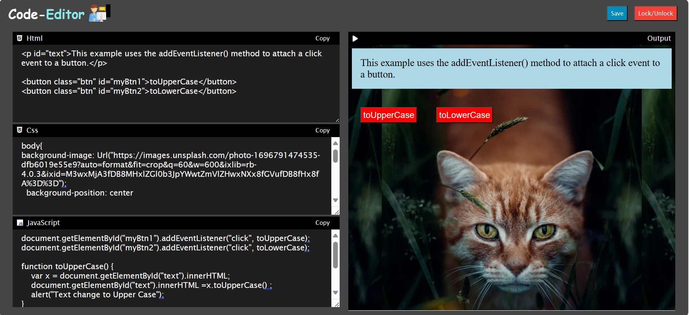

# Hi, I'm Saksham! 👋
I'm final year student of B.Tech CSE. I'm studing in College of Engineering Roorkee Uttarakhand.

##  About Me
I'm a Web developer...

## 🔗 Links

## Download
Go to github link and download zip file.
github link: https://github.com/Saksham-Kamboj/Web-Code-Editor.git

## Code-Editor
This editor allows you to write and run HTML, CSS, and JavaScript code using an online editor. The web view updates automatically in real-time as you write code.## Color Reference

## Color Reference
| Color             | Hex                                                                |
| ----------------- | ------------------------------------------------------------------ |
| Example Color |   #454545 |
| Example Color |   #feffff |
| Example Color |  #8ae8e8 |
| Example Color |   #f44336 |
| Example Color |   ##1f1f1f|
| Example Color |   # #008CBA |

## Screenshots

## Live Demo

## Deploy view
This site is live at <a href="https://saksham-kamboj.github.io/Web-Code-Editor/">Here</a>